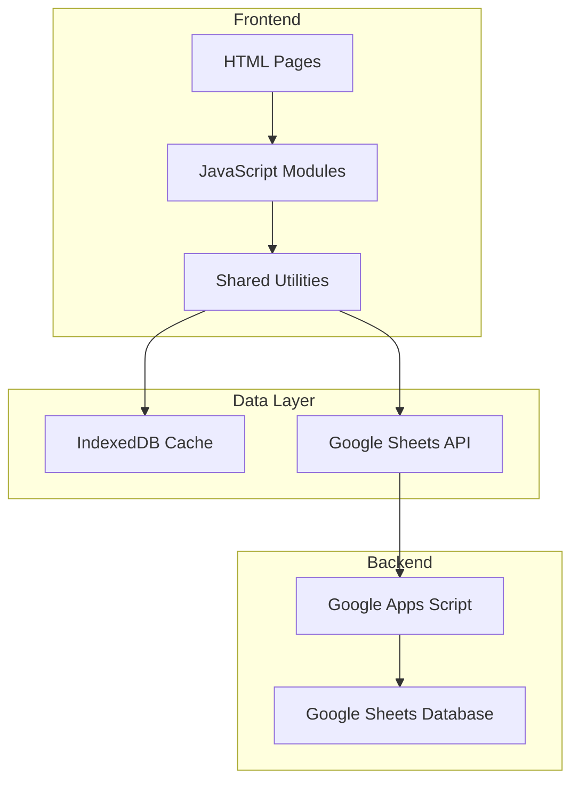

# Product Specification: LarosaWebApp

## 📋 Product Overview

**Product Name:** LarosaWebApp (LAROSAPOT Management System)  
**Version:** 1.0  
**Type:** Point of Sale (POS) & Inventory Management Web Application  
**Industry:** Retail - Pot & Plant Accessories

---

## 🎯 Business Context

LarosaWebApp adalah sistem manajemen bisnis berbasis web untuk **LAROSAPOT** - sebuah bisnis penjualan pot dan aksesoris tanaman. Aplikasi ini mengelola seluruh siklus bisnis mulai dari manajemen produk, transaksi penjualan, hingga pengelolaan pelanggan dan vendor.

---

## 🏗️ System Architecture



### Technology Stack

| Layer    | Technology                      |
| -------- | ------------------------------- |
| Frontend | HTML5, CSS3, Vanilla JavaScript |
| Caching  | IndexedDB                       |
| API      | Google Apps Script Web App      |
| Database | Google Sheets                   |
| Charts   | Chart.js                        |

---

## 📦 Module Specifications

### 1. Authentication Module

| Feature      | Description                                                                                                                 |
| ------------ | --------------------------------------------------------------------------------------------------------------------------- |
| **File**     | [index.html](file:///c:/laragon/www/LarosaWebApp/index.html), [auth.js](file:///c:/laragon/www/LarosaWebApp/script/auth.js) |
| **Purpose**  | User login & session management                                                                                             |
| **Features** | Login form, session persistence, auto-redirect                                                                              |

**User Flow:**

1. User memasukkan username & password
2. Sistem memvalidasi kredensial
3. Jika valid, redirect ke Dashboard
4. Session disimpan untuk persistent login

---

### 2. Dashboard Module

| Feature     | Description                                                                                                                                   |
| ----------- | --------------------------------------------------------------------------------------------------------------------------------------------- |
| **File**    | [dashboard.html](file:///c:/laragon/www/LarosaWebApp/dashboard.html), [dashboard.js](file:///c:/laragon/www/LarosaWebApp/script/dashboard.js) |
| **Purpose** | Ringkasan bisnis & statistik                                                                                                                  |

**Statistics Cards:**
| Metric | Deskripsi |
|--------|-----------|
| Jumlah Pelanggan | Total customer terdaftar |
| Jumlah Vendor | Total vendor/supplier |
| Barang Tersedia | Stok produk tersedia |
| Produk Terjual | Total unit terjual |
| Penjualan | Total nilai penjualan (Rp) |
| Pendapatan Diterima Dimuka | Total DP yang diterima |

**Charts:**

- Sales Trend (Line Chart)
- Kategori Produk (Pie/Doughnut Chart)

---

### 3. Point of Sale (Kasir) Module

| Feature     | Description                                                                                                                   |
| ----------- | ----------------------------------------------------------------------------------------------------------------------------- |
| **File**    | [kasir.html](file:///c:/laragon/www/LarosaWebApp/kasir.html), [kasir.js](file:///c:/laragon/www/LarosaWebApp/script/kasir.js) |
| **Purpose** | Pemrosesan transaksi penjualan                                                                                                |

**Input Fields:**

```
Invoice Info:
├── No Invoice (Auto-generated: INV-YYYYMMDD-XXX)
└── Tanggal Dibuat

Customer Info:
├── No Telepon Pelanggan (Autocomplete)
├── Nama Pelanggan (Auto-fill)
├── Alamat (Auto-fill)
└── Kasir (From session)

Transaction Settings:
├── Metode Pembayaran: Transfer | Tunai
└── Jenis Transaksi: Online | Offline

Cart (Keranjang):
├── No SKU (Autocomplete)
├── Jumlah
├── Harga (Auto-fill)
├── Nama Produk (Auto-fill)
├── Satuan (Auto-fill)
└── Total Harga (Calculated)
```

**Calculation Fields:**
| Field | Formula |
|-------|---------|
| Subtotal | SUM(item totals) |
| Packing | User input (supports formula) |
| Ongkir | User input (supports formula) |
| Diskon | User input (supports formula) |
| Total Tagihan | Subtotal + Packing + Ongkir - Diskon |
| DP 1 | User input |
| DP 2 | User input |  
| Pelunasan | User input |
| Sisa Tagihan | Total Tagihan - DP1 - DP2 - Pelunasan |

**Actions:**

- **DP Button:** Simpan sebagai transaksi Down Payment
- **Lunas Button:** Simpan sebagai transaksi Lunas

---

### 4. Quotation Module

| Feature     | Description                                                                                                                                                                                                                                                                                                   |
| ----------- | ------------------------------------------------------------------------------------------------------------------------------------------------------------------------------------------------------------------------------------------------------------------------------------------------------------- |
| **Files**   | [quotation.html](file:///c:/laragon/www/LarosaWebApp/quotation.html), [quotation.js](file:///c:/laragon/www/LarosaWebApp/script/quotation.js), [quotation_view.html](file:///c:/laragon/www/LarosaWebApp/quotation_view.html), [data_quotation.html](file:///c:/laragon/www/LarosaWebApp/data_quotation.html) |
| **Purpose** | Pembuatan & manajemen penawaran harga                                                                                                                                                                                                                                                                         |

**Features:**

- Buat quotation baru (mirip dengan Kasir tanpa DP)
- Lihat daftar quotation
- View quotation detail
- Convert quotation ke invoice

---

### 5. Product Inventory Module

| Feature     | Description                                                                                                                       |
| ----------- | --------------------------------------------------------------------------------------------------------------------------------- |
| **File**    | [produk.html](file:///c:/laragon/www/LarosaWebApp/produk.html), [produk.js](file:///c:/laragon/www/LarosaWebApp/script/produk.js) |
| **Purpose** | Manajemen stok & katalog produk                                                                                                   |

**Table Columns:**
| Column | Description |
|--------|-------------|
| SKU | Stock Keeping Unit (unique identifier) |
| NAMA PRODUK | Nama lengkap produk |
| KATEGORI | Klasifikasi produk |
| SATUAN | Unit (Pcs, Kg, etc.) |
| STOK SISTEM | Stok sesuai sistem |
| RESTOCK | Jumlah restock |
| TERJUAL | Jumlah terjual |
| STOK AKHIR SISTEM | Stok sistem setelah transaksi |
| STOK LAPANGAN | Stok aktual di gudang |
| SELISIH | Perbedaan stok sistem vs lapangan |
| STOK MINIMUM | Threshold reorder |
| KEKURANGAN STOK | Jumlah yang perlu direstock |
| HPP | Harga Pokok Penjualan |
| HARGA JUAL | Harga jual ke customer |

**Features:**

- Search by SKU/Name
- Filter by Category
- Pagination (10/25/50/100 per page)
- Add/Edit/Delete product

---

### 6. Customer Management Module

| Feature     | Description                                                                                                                               |
| ----------- | ----------------------------------------------------------------------------------------------------------------------------------------- |
| **File**    | [kustomer.html](file:///c:/laragon/www/LarosaWebApp/kustomer.html), [kustomer.js](file:///c:/laragon/www/LarosaWebApp/script/kustomer.js) |
| **Purpose** | Manajemen data pelanggan                                                                                                                  |

**Table Columns:**
| Column | Description |
|--------|-------------|
| TANGGAL | Tanggal registrasi |
| NAMA PELANGGAN | Nama customer |
| NO HP | Nomor telepon (unique) |
| ALAMAT | Alamat lengkap |
| KOTA | Kota |
| CHANNEL | Saluran akuisisi |
| JUMLAH TRANSAKSI | Total transaksi |

**Features:**

- Add/Edit/Delete customer
- Auto-increment transaction count

---

### 7. Vendor Management Module

| Feature     | Description                                                                                                                       |
| ----------- | --------------------------------------------------------------------------------------------------------------------------------- |
| **File**    | [vendor.html](file:///c:/laragon/www/LarosaWebApp/vendor.html), [vendor.js](file:///c:/laragon/www/LarosaWebApp/script/vendor.js) |
| **Purpose** | Manajemen data supplier/vendor                                                                                                    |

**Table Columns:**
| Column | Description |
|--------|-------------|
| NAMA VENDOR | Nama supplier |
| KATEGORI | Kategori produk yang disupply |
| NO HP | Nomor telepon |
| ALAMAT | Alamat vendor |
| KOTA | Kota |
| BANK | Nama bank |
| ATAS NAMA | Nama pemilik rekening |
| REKENING | Nomor rekening |

---

### 8. Transaction History Module

| Feature     | Description                                                                                                                           |
| ----------- | ------------------------------------------------------------------------------------------------------------------------------------- |
| **File**    | [riwayat.html](file:///c:/laragon/www/LarosaWebApp/riwayat.html), [riwayat.js](file:///c:/laragon/www/LarosaWebApp/script/riwayat.js) |
| **Purpose** | Riwayat semua transaksi                                                                                                               |

**Table Columns:**
| Column | Description |
|--------|-------------|
| No. | Nomor urut |
| Nomor Pesanan | Invoice number |
| Nama | Nama pelanggan |
| Total | Total tagihan |
| Aksi | Lihat/Edit/Hapus |

---

### 9. Payment Settlement (Pelunasan) Module

| Feature     | Description                                                                                                                                                                                                                                                                                                             |
| ----------- | ----------------------------------------------------------------------------------------------------------------------------------------------------------------------------------------------------------------------------------------------------------------------------------------------------------------------- |
| **Files**   | [pelunasan.html](file:///c:/laragon/www/LarosaWebApp/pelunasan.html), [pelunasan.js](file:///c:/laragon/www/LarosaWebApp/script/pelunasan.js), [form_pelunasan.html](file:///c:/laragon/www/LarosaWebApp/form_pelunasan.html), [form_edit_pelunasan.html](file:///c:/laragon/www/LarosaWebApp/form_edit_pelunasan.html) |
| **Purpose** | Tracking & proses pelunasan transaksi DP                                                                                                                                                                                                                                                                                |

**Table Columns:**
| Column | Description |
|--------|-------------|
| Tanggal | Tanggal transaksi |
| No Pesanan | Invoice number |
| Nama Pelanggan | Nama customer |
| Status | DP/LUNAS |
| Sisa Tagihan | Outstanding amount |
| Aksi | Lihat/Edit |

---

### 10. Invoice Module

| Feature     | Description                                                                                                                                                                                                                    |
| ----------- | ------------------------------------------------------------------------------------------------------------------------------------------------------------------------------------------------------------------------------ |
| **Files**   | [invoice.html](file:///c:/laragon/www/LarosaWebApp/invoice.html), [invoice_dp.html](file:///c:/laragon/www/LarosaWebApp/invoice_dp.html), [form_edit_invoice.html](file:///c:/laragon/www/LarosaWebApp/form_edit_invoice.html) |
| **Purpose** | Generate & print invoice                                                                                                                                                                                                       |

**Invoice Types:**

- Invoice Lunas (full payment)
- Invoice DP (partial payment)

---

## 🔧 Shared Components

### Data Service Layer

File: [data-service.js](file:///c:/laragon/www/LarosaWebApp/script/data-service.js)

**Pre-configured Services:**
| Service | Sheet Name | Cache Key |
|---------|------------|-----------|
| vendor | VENDOR | vendor_data_cache |
| customer | KOSTUMER | kustomer_data_cache |
| product | PERSEDIAAN BARANG | produk_data_cache |
| invoice | INVOICE | riwayat_data_cache |
| pelunasan | DP/Pelunasan | pelunasan_data_cache |

### Utility Functions

File: [utils.js](file:///c:/laragon/www/LarosaWebApp/script/utils.js)

| Function                 | Purpose                       |
| ------------------------ | ----------------------------- |
| `formatDisplayDate()`    | Format DD-MM-YYYY             |
| `formatDateForSheet()`   | Format DD-Mon-YYYY            |
| `formatCurrency()`       | Format Rp Indonesian currency |
| `formatPhoneNumber()`    | Format to 62xxx               |
| `showRefreshIndicator()` | Show loading indicator        |
| `getColumnValue()`       | Flexible column value lookup  |

### IndexedDB Cache

File: [idb-cache.js](file:///c:/laragon/www/LarosaWebApp/script/idb-cache.js)

**Cache Strategy:** Cache-first with background refresh

---

## 📊 Google Sheets Structure

| Sheet Name        | Purpose              |
| ----------------- | -------------------- |
| PERSEDIAAN BARANG | Product inventory    |
| KOSTUMER          | Customer data        |
| VENDOR            | Vendor/supplier data |
| INVOICE           | Transaction records  |
| DP/Pelunasan      | Payment tracking     |
| QUOTATION         | Quotation records    |
| LOGIN             | User credentials     |

---

## 🔐 Security Features

- Session-based authentication
- Auto-redirect for unauthenticated users
- bfcache handling for session verification
- Page visibility protection

---

## 🎨 UI/UX Features

- Responsive sidebar navigation
- Dynamic page title
- Global loading indicator
- Collapsible menu sections
- Autocomplete for SKU & phone number
- Formula support in input fields (=expression)

---

## 📁 Project Structure

```
LarosaWebApp/
├── index.html              # Login page
├── dashboard.html          # Dashboard
├── kasir.html              # POS/Cashier
├── quotation.html          # Create quotation
├── quotation_view.html     # View quotation
├── data_quotation.html     # Quotation list
├── produk.html             # Product inventory
├── kustomer.html           # Customer management
├── vendor.html             # Vendor management
├── riwayat.html            # Transaction history
├── pelunasan.html          # Payment settlement
├── invoice.html            # Invoice (full payment)
├── invoice_dp.html         # Invoice (DP)
├── form_pelunasan.html     # Add payment form
├── form_edit_pelunasan.html # Edit payment form
├── form_edit_invoice.html  # Edit invoice form
│
├── script/                 # JavaScript files
│   ├── config.js           # API configuration
│   ├── auth.js             # Authentication
│   ├── layout.js           # Sidebar & header injection
│   ├── sheets-api.js       # Google Sheets API client
│   ├── idb-cache.js        # IndexedDB caching
│   ├── utils.js            # Shared utilities
│   ├── data-service.js     # Data service layer
│   ├── dashboard.js        # Dashboard logic
│   ├── kasir.js            # POS logic (41KB)
│   ├── quotation.js        # Quotation logic
│   ├── produk.js           # Product logic
│   ├── kustomer.js         # Customer logic
│   ├── vendor.js           # Vendor logic
│   ├── riwayat.js          # History logic
│   ├── pelunasan.js        # Payment logic
│   ├── invoice.js          # Invoice logic
│   └── ...and more
│
├── style/                  # CSS files
│   ├── layout.css          # Common layout
│   ├── dashboard.css       # Dashboard styles
│   ├── kasir.css           # Kasir styles
│   ├── kustomer.css        # Kustomer styles
│   ├── produk.css          # Product styles
│   ├── riwayat.css         # History styles
│   └── login.css           # Login styles
│
└── asset/                  # Static assets
    └── image/
        └── larosa-logo.png # Company logo
```

---

## 📈 Future Enhancement Recommendations

1. **Reporting Module** - Export ke Excel/PDF
2. **Multi-user Support** - Role-based access control
3. **Notification System** - Low stock alerts
4. **Barcode Scanner** - Integrasi scanner untuk SKU
5. **Mobile App** - PWA atau native app
6. **Payment Gateway** - Integrasi pembayaran online
7. **Audit Trail** - Log perubahan data

---

## 📝 Notes

- Aplikasi ini designed untuk single-user/small team usage
- Data persistence mengandalkan Google Sheets sebagai database
- IndexedDB digunakan untuk offline-first experience
- Currency format: Indonesian Rupiah (Rp)
- Date format: DD-MM-YYYY (display), DD-Mon-YYYY (storage)
