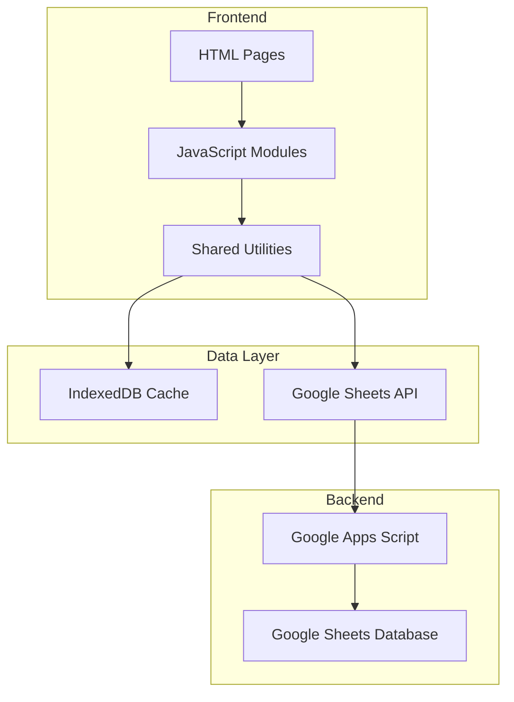

# Product Specification: LarosaWebApp

## 📋 Product Overview

**Product Name:** LarosaWebApp (LAROSAPOT Management System)  
**Version:** 1.1  
**Last Updated:** 26 Januari 2026  
**Type:** Point of Sale (POS) & Inventory Management Web Application  
**Industry:** Retail - Pot & Plant Accessories

---

## 🎯 Business Context

LarosaWebApp adalah sistem manajemen bisnis berbasis web untuk **LAROSAPOT** - sebuah bisnis penjualan pot dan aksesoris tanaman. Aplikasi ini mengelola seluruh siklus bisnis mulai dari manajemen produk, transaksi penjualan, hingga pengelolaan pelanggan dan vendor.

---

## 🏗️ System Architecture



### Technology Stack

| Layer    | Technology                      |
| -------- | ------------------------------- |
| Frontend | HTML5, CSS3, Vanilla JavaScript |
| Caching  | IndexedDB + LocalStorage        |
| API      | Google Apps Script Web App      |
| Database | Google Sheets                   |
| Charts   | Chart.js                        |

---

## 📦 Module Specifications

### 1. Authentication Module

| Feature      | Description                                                             |
| ------------ | ----------------------------------------------------------------------- |
| **Files**    | `index.html`, `auth.js`                                                 |
| **Purpose**  | User login & session management                                         |
| **Features** | Login form, session persistence, auto-redirect, detailed error messages |

**Recent Updates:**

- ✅ Improved error handling dengan pesan spesifik untuk connection errors
- ✅ Session-based authentication dengan sessionStorage

---

### 2. Dashboard Module

| Feature     | Description                      |
| ----------- | -------------------------------- |
| **Files**   | `dashboard.html`, `dashboard.js` |
| **Purpose** | Ringkasan bisnis & statistik     |

**Statistics Cards:**

- Jumlah Pelanggan
- Jumlah Vendor
- Barang Tersedia
- Produk Terjual
- Total Penjualan (Rp)
- Pendapatan Diterima Dimuka

**Charts:**

- Sales Trend (Line Chart)
- Kategori Produk (Pie/Doughnut Chart)

---

### 3. Point of Sale (Kasir) Module

| Feature     | Description                    |
| ----------- | ------------------------------ |
| **Files**   | `kasir.html`, `kasir.js`       |
| **Purpose** | Pemrosesan transaksi penjualan |

**Features:**

- Customer autocomplete by phone number
- Product autocomplete by SKU/Name
- Formula support in calculation fields (e.g., `=100000+50000`)
- Auto-generate invoice number (LR/INV/XX/DDMMYY)
- DP (Down Payment) & Lunas transaction types
- Edit mode for existing invoices
- Checkout mode (Quotation → Invoice conversion)

**Recent Updates:**

- ✅ Loading state pada tombol "Simpan DP" dan "Simpan Lunas"
- ✅ Button disabled saat proses saving
- ✅ Loading indicator untuk autocomplete suggestions

---

### 4. Quotation Module

| Feature     | Description                                                                    |
| ----------- | ------------------------------------------------------------------------------ |
| **Files**   | `quotation.html`, `quotation.js`, `quotation_view.html`, `data_quotation.html` |
| **Purpose** | Pembuatan & manajemen penawaran harga                                          |

**Features:**

- Create quotation (similar to Kasir, no payment)
- List all quotations
- View quotation detail
- Convert quotation to invoice (Checkout)
- Delete quotation with loading spinner

---

### 5. Product Inventory Module

| Feature     | Description                     |
| ----------- | ------------------------------- |
| **Files**   | `produk.html`, `produk.js`      |
| **Purpose** | Manajemen stok & katalog produk |

**Table Columns:**
SKU, NAMA PRODUK, KATEGORI, SATUAN, STOK SISTEM, RESTOCK, TERJUAL, STOK AKHIR SISTEM, STOK LAPANGAN, SELISIH, STOK MINIMUM, KEKURANGAN STOK, HPP, HARGA JUAL

**Features:**

- Search by SKU/Name
- Filter by Category
- Pagination (10/25/50/100 per page)
- Add/Edit/Delete product with loading states

**Recent Updates:**

- ✅ Fixed duplicate category filter (case-insensitive normalization)
- ✅ Loading spinner pada delete operation
- ✅ Loading state pada save operation

---

### 6. Customer Management Module

| Feature     | Description                    |
| ----------- | ------------------------------ |
| **Files**   | `kustomer.html`, `kustomer.js` |
| **Purpose** | Manajemen data pelanggan       |

**Table Columns:**
| Column | Alignment |
|--------|-----------|
| TANGGAL | Left |
| NAMA PELANGGAN | Left |
| NO HP | Left |
| ALAMAT | Left |
| KOTA | Left |
| CHANNEL | Left |
| JUMLAH TRANSAKSI | Center |
| AKSI | Center |

**Recent Updates:**

- ✅ Table alignment: Left untuk data text, Center untuk JUMLAH TRANSAKSI
- ✅ Loading spinner pada delete operation
- ✅ Auto-increment transaction count saat transaksi baru

---

### 7. Vendor Management Module

| Feature     | Description                    |
| ----------- | ------------------------------ |
| **Files**   | `vendor.html`, `vendor.js`     |
| **Purpose** | Manajemen data supplier/vendor |

**Table Columns:**
NAMA VENDOR, KATEGORI, NO HP, ALAMAT, KOTA, BANK, ATAS NAMA, REKENING

**Recent Updates:**

- ✅ Loading spinner pada delete operation

---

### 8. Transaction History Module

| Feature     | Description                  |
| ----------- | ---------------------------- |
| **Files**   | `riwayat.html`, `riwayat.js` |
| **Purpose** | Riwayat semua transaksi      |

**Features:**

- View all invoices
- View invoice detail
- Edit invoice
- Delete invoice (with all related items)

**Recent Updates:**

- ✅ Loading spinner pada delete operation
- ✅ Multi-row delete for invoices with multiple items

---

### 9. Payment Settlement (Pelunasan) Module

| Feature     | Description                                                                         |
| ----------- | ----------------------------------------------------------------------------------- |
| **Files**   | `pelunasan.html`, `pelunasan.js`, `form_pelunasan.html`, `form_edit_pelunasan.html` |
| **Purpose** | Tracking & proses pelunasan transaksi DP                                            |

**Features:**

- List unpaid invoices (status: DP)
- Process payment
- Edit payment records
- Default payment method: Transfer

---

### 10. Invoice Module

| Feature     | Description                                                 |
| ----------- | ----------------------------------------------------------- |
| **Files**   | `invoice.html`, `invoice_dp.html`, `form_edit_invoice.html` |
| **Purpose** | Generate & print invoice                                    |

**Invoice Types:**

- Invoice Lunas (full payment)
- Invoice DP (partial payment with remaining balance)

---

## 🔧 Shared Components

### Data Service Layer (`data-service.js`)

| Service   | Sheet Name        | Cache Key            |
| --------- | ----------------- | -------------------- |
| vendor    | VENDOR            | vendor_data_cache    |
| customer  | KOSTUMER          | kustomer_data_cache  |
| product   | PERSEDIAAN BARANG | produk_data_cache    |
| invoice   | INVOICE           | riwayat_data_cache   |
| pelunasan | DP/Pelunasan      | pelunasan_data_cache |

### Utility Functions (`utils.js`)

| Function               | Purpose                       |
| ---------------------- | ----------------------------- |
| `formatDisplayDate()`  | Format DD-MM-YYYY             |
| `formatDateForSheet()` | Format DD-Mon-YYYY            |
| `formatCurrency()`     | Format Rp Indonesian currency |
| `formatPhoneNumber()`  | Format to 62xxx               |
| `getValueFromKeys()`   | Flexible column value lookup  |

### Global Loader (`layout.js`)

| Function             | Purpose              |
| -------------------- | -------------------- |
| `showGlobalLoader()` | Show loading spinner |
| `hideGlobalLoader()` | Hide loading spinner |

---

## 📊 Google Sheets Structure

| Sheet Name        | Header Row | Start Column | Insert At |
| ----------------- | ---------- | ------------ | --------- |
| KOSTUMER          | 5          | B            | Top       |
| PERSEDIAAN BARANG | 6          | B            | Bottom    |
| USERS             | 1          | A            | Bottom    |
| INVOICE           | 48         | B            | Top       |
| DP/Pelunasan      | 52         | B            | Top       |
| DATA_QUOTATION    | 4          | A            | Top       |
| QUOTATION         | 50         | B            | Top       |
| VENDOR            | 5          | B            | Bottom    |

---

## 🔐 Backend API (Google Apps Script)

### Endpoints

| Action                  | Method | Description                          |
| ----------------------- | ------ | ------------------------------------ |
| `read`                  | GET    | Read sheet data                      |
| `add`                   | POST   | Add new row                          |
| `update`                | POST   | Update existing row                  |
| `delete`                | POST   | Delete single row                    |
| `delete-invoice`        | POST   | Delete invoice with all items        |
| `login`                 | POST   | Authenticate user                    |
| `increment-transaction` | POST   | Increment customer transaction count |

### Row Formatting (Auto-applied on Add)

| Column Type      | Alignment |
| ---------------- | --------- |
| Text columns     | Left      |
| JUMLAH TRANSAKSI | Center    |
| Numeric columns  | Right     |

---

## 🧪 Testing

### Frontend Test Cases

#### 1. Authentication & System Access

| ID      | Test Case                           | Expected Result                             |
| ------- | ----------------------------------- | ------------------------------------------- |
| AUTH-01 | Login dengan kredensial valid       | Redirect ke dashboard, session tersimpan    |
| AUTH-02 | Login dengan password salah         | Tampil error "Username atau password salah" |
| AUTH-03 | Login saat koneksi error            | Tampil error spesifik koneksi               |
| AUTH-04 | Logout                              | Redirect ke login, session terhapus         |
| AUTH-05 | Akses halaman protected tanpa login | Redirect ke login page                      |

#### 2. Dashboard

| ID      | Test Case      | Expected Result                          |
| ------- | -------------- | ---------------------------------------- |
| DASH-01 | Load statistik | Semua card menampilkan data dengan benar |

#### 3. Stok Produk

| ID      | Test Case       | Expected Result                         |
| ------- | --------------- | --------------------------------------- |
| PROD-01 | List produk     | Tabel render dengan pagination          |
| PROD-02 | Search produk   | Filter berdasarkan SKU/Nama             |
| PROD-03 | Filter kategori | Tidak ada duplikat kategori di dropdown |
| PROD-04 | Tambah produk   | Loading state, data tersimpan           |
| PROD-05 | Edit produk     | Perubahan tersimpan ke Sheet            |
| PROD-06 | Hapus produk    | Loading spinner, row terhapus           |
| PROD-07 | Restock produk  | Stok terupdate                          |

#### 4. Kasir (POS)

| ID     | Test Case              | Expected Result                           |
| ------ | ---------------------- | ----------------------------------------- |
| POS-01 | Autocomplete pelanggan | Suggestions muncul saat ketik nomor HP    |
| POS-02 | Tambah ke keranjang    | Item masuk tabel, subtotal update         |
| POS-03 | Kalkulasi total        | Formula ongkir/diskon berfungsi           |
| POS-04 | Simpan Lunas           | Loading state, data ke INVOICE sheet      |
| POS-05 | Simpan DP              | Loading state, data ke DP/Pelunasan sheet |

#### 5. Data Pelanggan

| ID      | Test Case           | Expected Result                      |
| ------- | ------------------- | ------------------------------------ |
| CUST-01 | Tambah pelanggan    | Data tersimpan, JUMLAH TRANSAKSI = 0 |
| CUST-02 | Increment transaksi | Count bertambah setelah transaksi    |
| CUST-03 | Edit pelanggan      | Perubahan tersimpan                  |

#### 6. Riwayat Transaksi

| ID      | Test Case            | Expected Result            |
| ------- | -------------------- | -------------------------- |
| HIST-01 | View riwayat         | Grouped by Invoice ID      |
| HIST-02 | Lihat detail invoice | Redirect ke invoice view   |
| HIST-03 | Edit invoice         | Data pre-filled di form    |
| HIST-04 | Hapus invoice        | Semua row terkait terhapus |

#### 7. Quotation & Pelunasan

| ID      | Test Case          | Expected Result              |
| ------- | ------------------ | ---------------------------- |
| QUOT-01 | Buat quotation     | Tersimpan ke QUOTATION sheet |
| QUOT-02 | Checkout quotation | Data masuk ke Kasir page     |
| PEL-01  | View hutang        | Tampil invoice status DP     |
| PEL-02  | Bayar hutang       | Status berubah ke Lunas      |

---

### Backend API Test Cases

#### 1. READ Operations

| ID     | Test Case              | Expected Result                |
| ------ | ---------------------- | ------------------------------ |
| BE-R01 | Read KOSTUMER sheet    | Return array of customers      |
| BE-R02 | Read PERSEDIAAN BARANG | Return array of products       |
| BE-R03 | Read invalid sheet     | Return error "Sheet not found" |
| BE-R04 | Read DATA_QUOTATION    | Return quotation data          |
| BE-R05 | Read INVOICE           | Return invoice data            |
| BE-R06 | Read VENDOR            | Return vendor list             |

#### 2. Authentication

| ID     | Test Case               | Expected Result                |
| ------ | ----------------------- | ------------------------------ |
| BE-L01 | Login valid credentials | `{success: true, user: "..."}` |
| BE-L02 | Login wrong password    | `{success: false}`             |
| BE-L03 | Login non-existent user | `{success: false}`             |
| BE-L04 | Login empty credentials | `{success: false}`             |

#### 3. Error Handling

| ID     | Test Case                | Expected Result         |
| ------ | ------------------------ | ----------------------- |
| BE-E01 | Invalid JSON body        | Return error            |
| BE-E02 | Missing action parameter | Return "Invalid action" |
| BE-E03 | Empty POST body          | Return error            |
| BE-E04 | Invalid action name      | Return "Invalid action" |

#### 4. ADD Operations

| ID     | Test Case            | Expected Result             |
| ------ | -------------------- | --------------------------- |
| BE-A01 | Add new customer     | Row inserted at top         |
| BE-A02 | Add new product      | Row inserted at bottom      |
| BE-A03 | Add new vendor       | `{success: true}`           |
| BE-A07 | Add with empty data  | Row added with empty values |
| BE-A09 | Add to invalid sheet | Return error                |

#### 5. UPDATE Operations

| ID     | Test Case            | Expected Result        |
| ------ | -------------------- | ---------------------- |
| BE-U01 | Update customer name | Field updated          |
| BE-U02 | Update product price | Price updated in sheet |

#### 6. DELETE & Special Operations

| ID     | Test Case                    | Expected Result         |
| ------ | ---------------------------- | ----------------------- |
| BE-D06 | Delete non-existent invoice  | Return "Deleted 0 rows" |
| BE-T02 | Increment non-existent phone | Return error            |

---

### Backend API Test Results (24 Jan 2026)

| Category          | Tests  | Passed | Status   |
| ----------------- | ------ | ------ | -------- |
| READ Operations   | 6      | 6      | ✅       |
| Authentication    | 4      | 4      | ✅       |
| Error Handling    | 4      | 4      | ✅       |
| ADD Operations    | 5      | 5      | ✅       |
| UPDATE Operations | 2      | 2      | ✅       |
| DELETE Operations | 2      | 2      | ✅       |
| DELETE Operations | 2      | 2      | ✅       |
| **Total Backend** | **23** | **23** | **100%** |

### Test Summary

| Type      | Total Tests | Passed | Status   |
| --------- | ----------- | ------ | -------- |
| Frontend  | 29          | 29     | ✅       |
| Backend   | 23          | 23     | ✅       |
| **Total** | **52**      | **52** | **100%** |

---

## 📁 Project Structure

```
LarosaWebApp/
├── index.html              # Login page
├── dashboard.html          # Dashboard
├── kasir.html              # POS/Cashier
├── quotation.html          # Create quotation
├── quotation_view.html     # View quotation
├── data_quotation.html     # Quotation list
├── produk.html             # Product inventory
├── kustomer.html           # Customer management
├── vendor.html             # Vendor management
├── riwayat.html            # Transaction history
├── pelunasan.html          # Payment settlement
├── invoice.html            # Invoice (full payment)
├── invoice_dp.html         # Invoice (DP)
├── form_pelunasan.html     # Add payment form
├── form_edit_pelunasan.html # Edit payment form
├── form_edit_invoice.html  # Edit invoice form
│
├── script/                 # JavaScript files (23 files)
├── style/                  # CSS files (8 files)
├── asset/                  # Static assets
└── docs/                   # Documentation
```

---

## 📈 Version History

| Version | Date     | Changes                                                                                         |
| ------- | -------- | ----------------------------------------------------------------------------------------------- |
| 1.0     | Dec 2025 | Initial release                                                                                 |
| 1.1     | Jan 2026 | Loading states, duplicate filter fix, improved error handling, table alignment, backend testing |

---

## 📝 Notes

- Single-user/small team usage
- Google Sheets sebagai database
- IndexedDB untuk offline-first experience
- Currency: Indonesian Rupiah (Rp)
- Date format: DD-MM-YYYY (display), DD-Mon-YYYY (storage)
